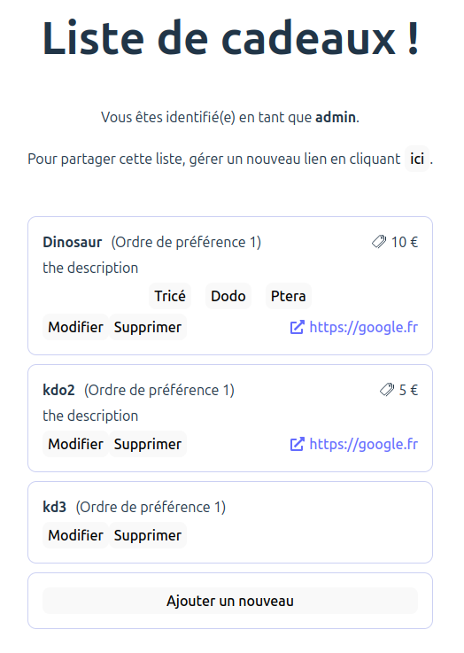

# kdo-app

It's a little app for sharing your gift list. It uses Google Sheet as backend-ish to provide a better interface (than
Google Sheet) to reserve presents.

_kdo pronounce 'k'-'do' in French have the same pronunciation as 'cadeau' which means 'present' in French._

The view where the users can reserve a gift:

The Google Sheet view (where to add/edit the gift list):

## How to set up

1. You will need to generate a Google API key to access the Google Sheet API.
   See [Google doc](https://developers.google.com/maps/documentation/javascript/get-api-key).
2. Create a new Google Sheet, add two sheets named:
    1. `gifts`: The columns are `Name`, `Subdivisions` (for example for books in the same series), `Order`,
       `Description`, `Link`, `Price`. There can be more columns, it doesn't matter. The first line is ignored (and can
       be used to put column names). This is where you will need to add your list.
    2. `reservations`: At least one column. There nothing to step-up here. There can be more columns, it doesn't matter.
3. Fork the repo (you won't be able to use my deployment on GitHub Pages,
   see [Technical information](#technical-information))
4. Update the `valid_key`, `valid_sheet` arrays in `App.tsx` with the sha512 values of your key(s)/sheet id(s).
5. Push, the project will be published to your GitHub Pages!

## How to use

On the created Google Sheet in the `gifts` sheet add your gift list. Share the link of the app with Santa Claus
_and hope your small ugly python project didn't put you on the naughty list_.

If you want to keep _part_ of the surprise, just make sure not to go on the webpage or look at the `reservations`
sheet.
It is possible to edit the list even after you shared the list. If you want to completely change a gift or remove it,
you will also have to remove the associated line in the `reservations` sheet: the gift in line $n$ is associated to the
reservation in line $n-1$.

## Technical information

This is a small React project based on the vite template. It uses a Google API key and a Google Sheet id to query
`gifts!A2:F1000` and `reservations!A1:A1000` from a Google Sheet to display the gift list. This makes it possible to
host the website on GitHub Pages.
To ensure your deployment on GitHub Pages is not unused illegitimately (for instance by trying to inject js via a
crafted Google Sheet), the specified Google Sheet id is checked against a hash list of validate ids. There are also
steps taken to prevent html injection in the first place.
As there is no easy way to prevent illegitimate usage of the Google API key if stored in the source code (the HTTP
referer can be trivially bypass using curl or any software that can craft an HTTP header ; the IP restriction doesn't
apply as all GitHub Pages share the same IPs - that being said you definitely should add this restriction anyway), a
similar mechanism ensure that only your Google API key(s) can be used on your deployment.

## Contributions

Any contributions are welcome. Please check the issues and pull requests before submitting anything.
Also keep in mind that this is a side quest, and I'll most likely disregard any 'big' PR trying to add significant
complexity.

## LICENSE

This software is licensed under the GNU GENERAL PUBLIC LICENSE v3.0